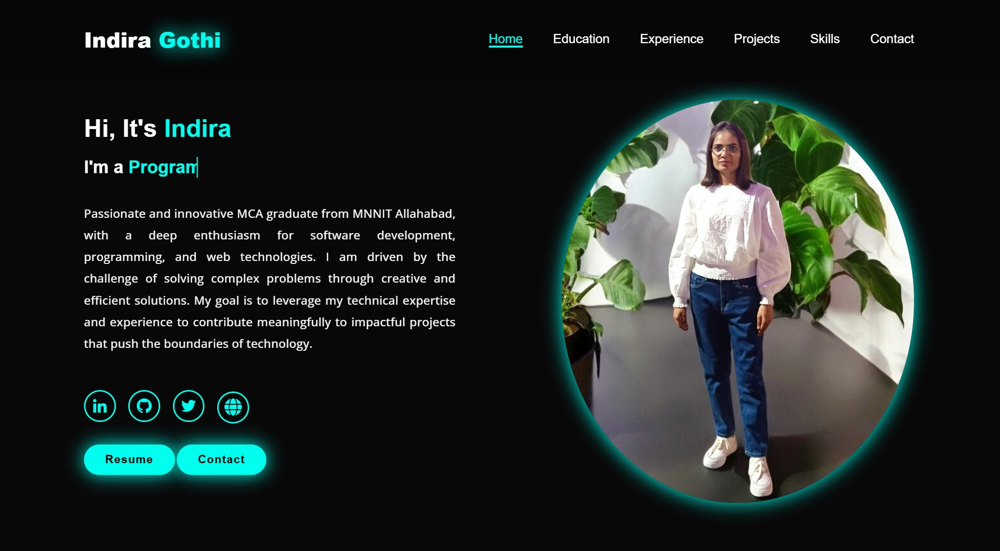

# Personal_portfolio - Showcasing My Work and Skills

## Live link :  https://ig-portfolio.onrender.com/

### -Designed and developed a personal portfolio website to showcase my skills, projects, and professional experiences.

### -Crafted a responsive and visually appealing layout using HTML, CSS, and JavaScript, ensuring compatibility across different devices and screen sizes.

### -Implemented a clean and intuitive user interface, including a dedicated section for skills represented with progress bars, effectively visualizing my proficiency in various technologies.

##  Tech Stack: HTML, CSS, JavaScript

